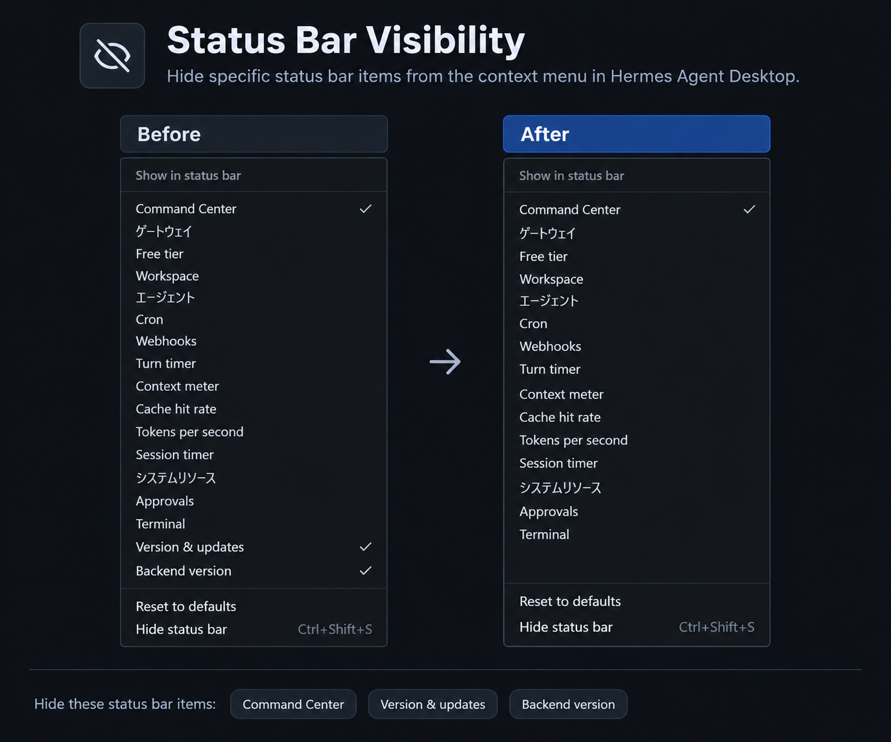

# Status Bar Visibility

[English](README.md) | [日本語](README.ja.md)

A Hermes Agent Desktop Plugin that can hide the following status-bar items, whose visibility cannot normally be toggled:

- Command Center
- Version & updates
- Backend version

You can toggle the visibility of each item from the status bar's context menu.

## 1. Installation

### 1.1. Install from Hermes Agent Desktop

1. Open the [installation link](hermes://plugin/install?repo=l7u7ch/hermes-agent-desktop-plugin-status-bar-visibility). Hermes Agent Desktop will open and display the installation screen.
2. If you cannot open the installation link, open **Settings → Plugins → Install from Git** in Hermes Agent Desktop, then install `l7u7ch/hermes-agent-desktop-plugin-status-bar-visibility`.
3. Enable **Status Bar Visibility**.

### 1.2. Install manually

1. Obtain `plugin.js` from this repository.
2. On the computer running Hermes Agent Desktop, place `plugin.js` at one of the following paths. The folder name must match the Plugin ID: `hermes-agent-desktop-plugin-status-bar-visibility`.
   - Windows: `%LOCALAPPDATA%\hermes\desktop-plugins\hermes-agent-desktop-plugin-status-bar-visibility\plugin.js`
   - macOS: `~/.hermes/desktop-plugins/hermes-agent-desktop-plugin-status-bar-visibility/plugin.js`
   - Linux: `~/.hermes/desktop-plugins/hermes-agent-desktop-plugin-status-bar-visibility/plugin.js`
   - When `HERMES_HOME` is set: `$HERMES_HOME/desktop-plugins/hermes-agent-desktop-plugin-status-bar-visibility/plugin.js`
3. Enable **Status Bar Visibility** from **Settings → Plugins** in Hermes Agent Desktop.

## 2. Notes

- Do not place this plugin on a Remote Gateway. Install it on the computer running Hermes Agent Desktop.
- This plugin is disabled by default. Enable it in Hermes Agent Desktop.
- The plugin supplements the standard Hermes Agent Desktop UI through DOM manipulation, so a Hermes Agent Desktop update may break compatibility.
- Disabling or removing the plugin restores the standard status-bar display.
- The plugin was tested with the following Hermes Agent Desktop version:
  - Hermes Agent v0.21.2 (2026.9.11)
  - Commit ID: [`5eb99eb2844b22ebb723711b8e6a0bbb80bb5f04`](https://github.com/NousResearch/hermes-agent/commit/5eb99eb2844b22ebb723711b8e6a0bbb80bb5f04)